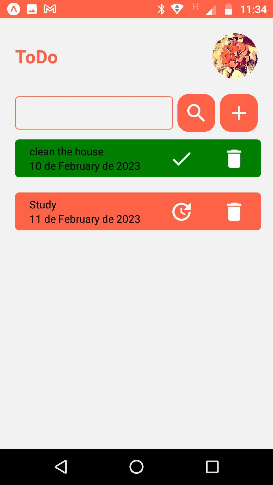
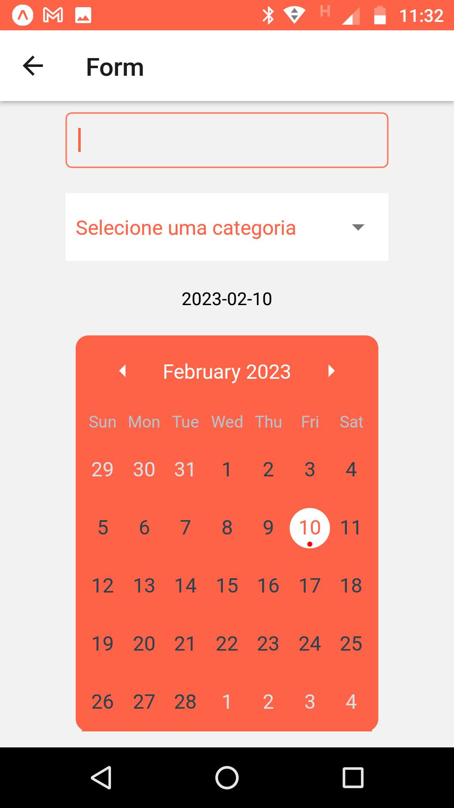

<h2>ToDo List React Native</h2>

 

<ul>
<li>React Native</li>
</ul>

 

 ToDo List Exercise developed during Senai's DEVinHouse course on 2022.

 ToDo List Exercise developed during Senai's DEVinHouse course on 2022.

You can add, delete or mark tasks as done.

The exercise uses a date-fns calendar and a fake API.

 

    

 

    

